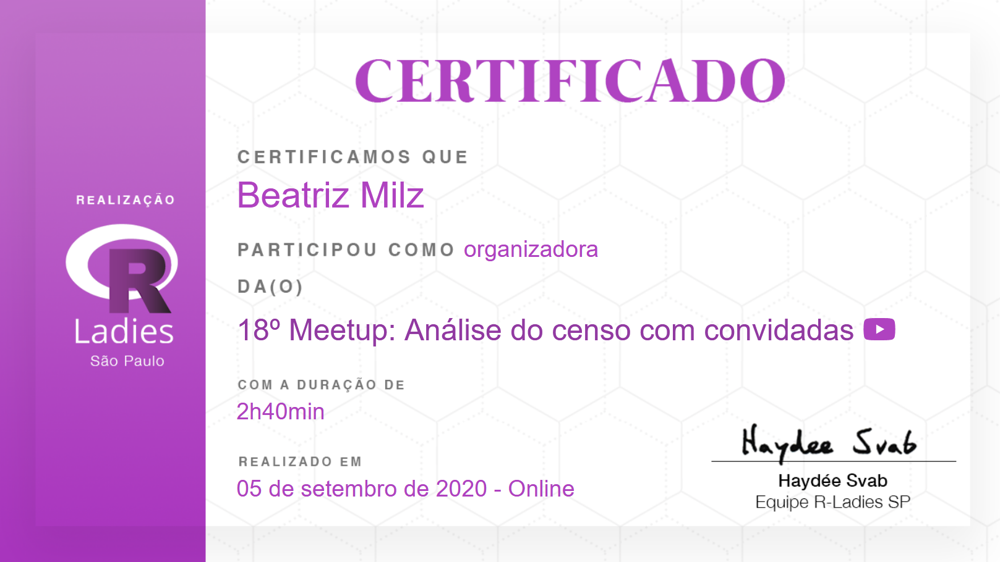
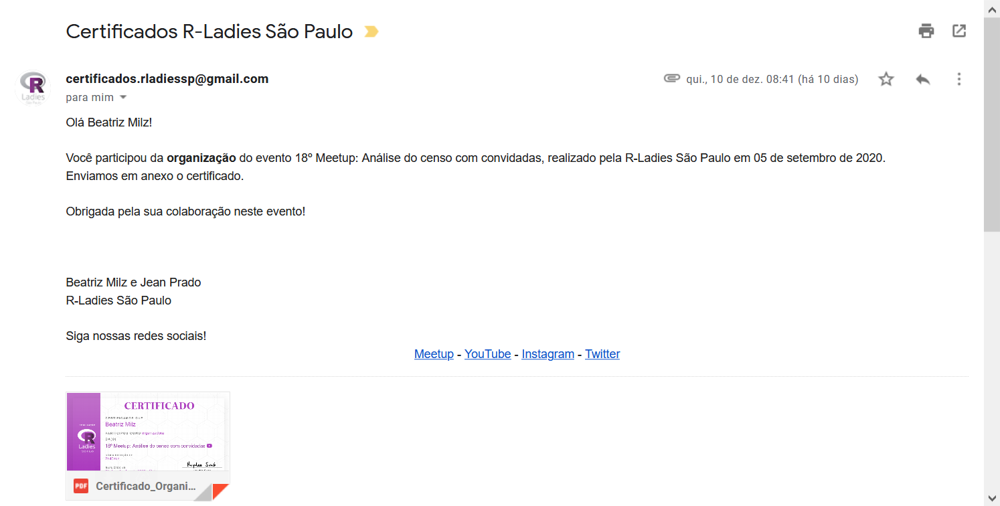
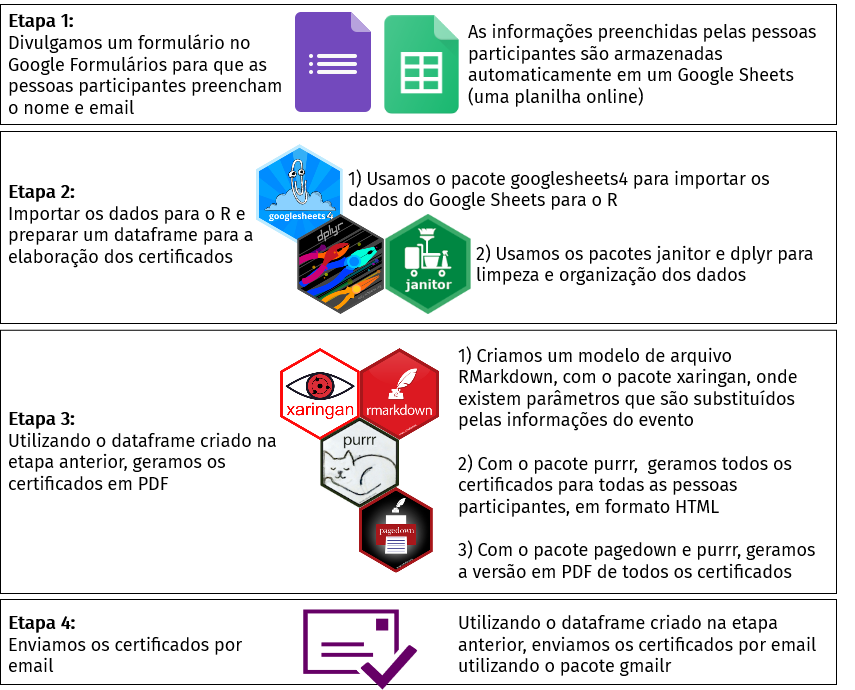

layout: true
  
```{r setup, include=FALSE}
options(htmltools.dir.version = FALSE)

knitr::opts_chunk$set(
  echo = FALSE,
  fig.align = "center",
  message = FALSE,
  warning = FALSE
)

library(magrittr)
```


```{r xaringanExtra, echo=FALSE}
xaringanExtra::use_logo(
  image_url = "https://beatrizmilz.github.io/slidesR/introR/img/rainbow-inclusive.png",
  link_url = "https://github.com/R-Ladies-Sao-Paulo/RLadies-Brasil",
  exclude_class = c("hide-logo", "title-slide")
)

```

```{r xaringanExtra-share-again, echo=FALSE}
xaringanExtra::use_share_again()
```

```{r metathis, echo=FALSE}
metathis::meta() %>%
  metathis::meta_name("github-repo" = params$github_repo_apresentacao) %>% 
  metathis::meta_social(
    title = glue::glue("R-Ladies {params$capitulo}"),
    description = glue::glue(
      "Apresentação sobre a R-Ladies {params$capitulo}"
    ),
    url = params$url_apresentacao,
    image = params$url_share_card,
    image_alt = glue::glue(
      "Primeiro slide da apresentação sobre ",
      "a R-Ladies {params$capitulo}"
    ))
```

---
class: perfil

# Quem somos nós?

.pull-left[
### Jean Prado

]

.pull-right[
### Beatriz Milz
<a href='https://beatrizmilz.com'><i class="fas fa-house-user"></i></a>    <a href='mailto:beatriz.milz@usp.br'><i class="far fa-envelope"></i></a>   <a href='https://twitter.com/BeaMilz'  target="_blank"><i class="fab fa-twitter"></i></a>   <a href='https://github.com/beatrizmilz' target="_blank"><i class="fab fa-github"></i></a>   <a href='https://orcid.org/0000-0002-3064-4486' target="_blank"><i class="fab fa-orcid"></i></a>   <a href='http://lattes.cnpq.br/5150665880581477' target="_blank"><i class="ai ai-lattes"></i></a>   <a href='https://beatrizmilz.github.io/resume/index.html' target="_blank"><i class="ai ai-cv"></i></a>   <a href='https://discourse.curso-r.com/u/beatrizmilz/summary' target="_blank"><i class="fab fa-discourse"></i></a> <a href='https://www.instagram.com/beatrizmilz/' target="_blank"><i class="fab fa-instagram"></i></a> 

- [Instrutora de `tidyverse` certificada pela RStudio](https://education.rstudio.com/trainers/people/milz+beatriz/)
- Co-organizadora: [R-Ladies São Paulo](https://www.meetup.com/R-Ladies-Sao-Paulo/), [satRday São Paulo](https://saopaulo2019.satrdays.org/), [LatinR](https://latin-r.com/pt), [useR! 2021 global](https://user2021.r-project.org/)
- Doutoranda em Ciência Ambiental (IEE/USP)
- Mestre em Ciências (UNIFESP)
- Bacharela em Gestão Ambiental (EACH/USP)
- [Embaixadora de Inovação Cívica da Open Knowledge Brasil](https://embaixadoras.ok.org.br/).

]

---
class: 

# Objetivos 

<br><br>


Apresentar alguns projetos/repositórios no GitHub onde utilizamos R, feitos para auxiliar nas atividades de organização da R-Ladies:

- [Robô de boas vindas](https://github.com/R-Ladies-Sao-Paulo/rladies-sp-welcome-bot)
 
- Certificados

- RLadiesTheme

- RLadies Brasil

---
class: middle, center, inverse

# Robô de boas vindas

---
class: 

# Robô de boas vindas

- Pessoas colaboradoras:
  - Jean Prado


- Principais pacotes utilizados: 
  - [telegram.bot](https://github.com/ebeneditos/telegram.bot)
---

class: middle, center, diagramas, hide-logo

# Exemplo de mensagem enviada

```{r echo=FALSE, out.width="60%"}

```


---
class: middle, center, inverse

# Certificados

---
class: 

# Certificados

- Repositório privado no GitHub.

- Projeto de uso interno: apenas para uso das pessoas organizadoras.

- Objetivo: facilitar o envio de certificados para as pessoas participantes dos eventos.

- Pessoas colaboradoras:
  - [Geovanna Lopes](https://www.linkedin.com/in/geovanalopes/)
  - [Ianní Muliterno](https://www.linkedin.com/in/iann%C3%AD-muliterno/)
  - Jean Prado
  - Beatriz Milz

---
class: middle, center, diagramas, hide-logo

# Exemplo do certificado gerado


```{r echo=FALSE}

```

---
class: middle, center, diagramas, hide-logo

# Exemplo do email enviado

```{r echo=FALSE}

```


---
class: diagramas, hide-logo

```{r, out.width="90%", fig.align='center'}

```


---
class: 

# Certificados

- Principais pacotes usados:
  - [googlesheets4](https://googlesheets4.tidyverse.org/) - obtenção dos dados no Google Sheets
  - [janitor](https://github.com/sfirke/janitor), [dplyr](https://dplyr.tidyverse.org/) - limpeza e manipulação de dados
  - [rmarkdown](https://rmarkdown.rstudio.com/), [purrr](https://purrr.tidyverse.org/), [xaringan](https://github.com/yihui/xaringan), [pagedown](https://github.com/rstudio/pagedown) - gerar o certificado
  - [beepr](https://www.r-project.org/nosvn/pandoc/beepr.html) - sons para avisar que o código foi executado
  - [gmailr](https://gmailr.r-lib.org/) - envio dos emails através da API do gmail
  
- Possibilidade de melhorias:
  - Diminuir necessidade de mudança/escrita..
  - Melhorar o fluxo para cada tipo de certificado (pessoas organizadoras, pessoas participantes, pessoas palestrantes)

---
class: middle, center, inverse

# RLadiesTheme


---
class: 

# RLadiesTheme

- Objetivo: disponibilizar temas em RMarkdown de uso da comunidade R-Ladies São Paulo 

- Como surgiu ?

  - Apresentação sobre a comunidade R-Ladies São Paulo, que usamos no começo de todos os eventos.

  - Primeira versão dessa apresentação foi criada em dezembro de 2018.
  
  - A apresentação apresenta dados gerados a partir da base do R Community Explorer.
  
  - A cada evento a gente knitava o documento para que os números fossem atualizados.
  
  
---
class: 

# RLadiesTheme

- Como surgiu ? (continuação)
  
  - Ideia: automatizar a atualização da apresentação.
  
  - Ideia 2: deixar a apresentação como um tema no RMarkdown para que qualquer pessoa consiga utilizar e adaptar para diferentes capítulos.


---
class: 

# RLadiesTheme

- Principais pacotes usados:
  - [actions](https://github.com/r-lib/actions) - GitHub Actions para a comunidade R
  - [rmarkdown](https://rmarkdown.rstudio.com/), [xaringan](https://github.com/yihui/xaringan), [pagedown](https://github.com/rstudio/pagedown), xaringanExtra, fs, tidyverse
  
- Próximos passos:
  - Mudar o tema CSS da apresentação com xaringan;
  - Testar a instalação do pacote em outros computadores;
  - Pedir para pessoas de outros capítulos testarem e fazer sugestões;
  - Documentar no README sobre como usar o pacote;
  - Expandir os templates Rmd... sugestões?

---
class: middle, center, inverse

# RLadiesBrasil


---
class: 

# RLadiesBrasil

- Principais pacotes usados:
  - [actions](https://github.com/r-lib/actions) - GitHub Actions para a comunidade R
  - [rmarkdown](https://rmarkdown.rstudio.com/)
  - meetupr
  - sodium, cyphr

---
class:

# Saiba mais sobre a R-Ladies
.pull-left[

- R-Ladies Global: [Website](https://rladies.org/), [<i class="fab fa-twitter"></i> Twitter](https://twitter.com/rladiesglobal)


- R-Ladies `r params$capitulo`: 
  - [<i class="fab fa-twitter"></i> Twitter](https://twitter.com/`r params$twitter`)
  - [<i class="fab fa-instagram"></i> Instagram](https://instagram.com/`r params$instagram`)
  - [<i class="fab fa-facebook"></i> Facebook](https://facebook.com/`r params$facebook`)
  - [<i class="fab fa-meetup"></i> Meetup](`r params$meetup_url`)
  - [<i class="fab fa-github"></i> GitHub](https://github.com/`r params$github`)
  - [<i class="fab fa-youtube"></i> Youtube](https://www.youtube.com/c/`r params$youtube`)


<center>
<a class="github-button" href="https://github.com/R-Ladies-Sao-Paulo/RLadies-Brasil" data-color-scheme="no-preference: light; light: light; dark: dark;" data-size="large" data-show-count="true" aria-label="Star R-Ladies-Sao-Paulo/RLadies-Brasil on GitHub">Capítulos e eventos online da R-Ladies no Brasil</a>
</center>

]


.pull-right[
```{r fig.cap="Ilustração por <a href='https://twitter.com/allison_horst' target=_blank>@allison_horst</a>" , out.width="70%"}
knitr::include_graphics("https://beatrizmilz.github.io/slidesR/rladies/img/allisonhorst/principio_agora_pt.png")
```

- Apresentação feita por [Beatriz Milz](https://beatrizmilz.com) com o pacote [xaringan](https://github.com/yihui/xaringan), com o tema `metropolis` modificado.
]


<!-- inicio font awesome -->
<script src="https://kit.fontawesome.com/1f72d6921a.js" crossorigin="anonymous"></script>
<!-- final font awesome -->

<!-- inicio github buttons  -->
<script async defer src="https://buttons.github.io/buttons.js"></script>
<!-- final github buttons  -->
